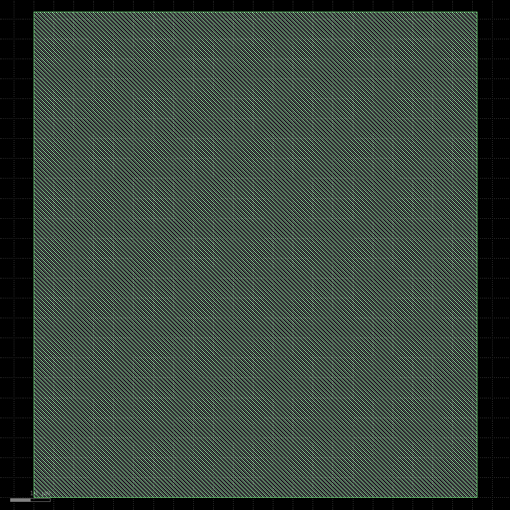
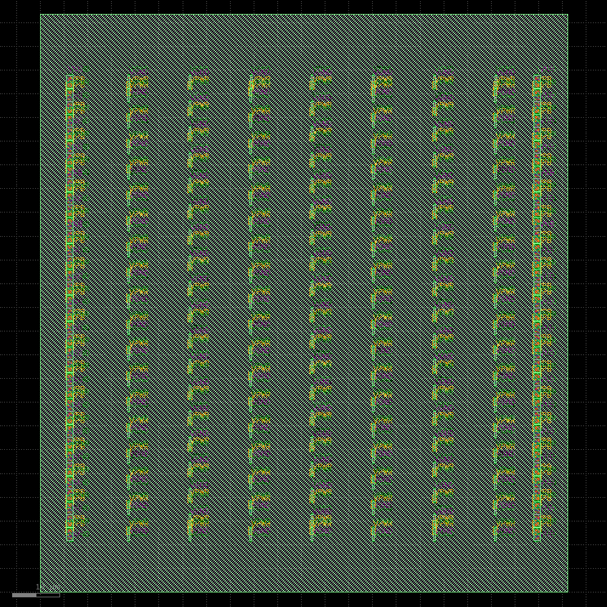
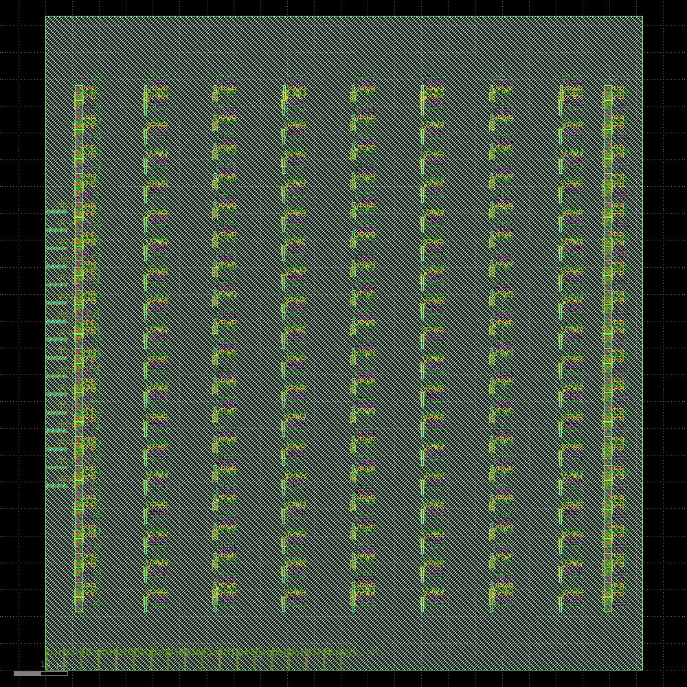
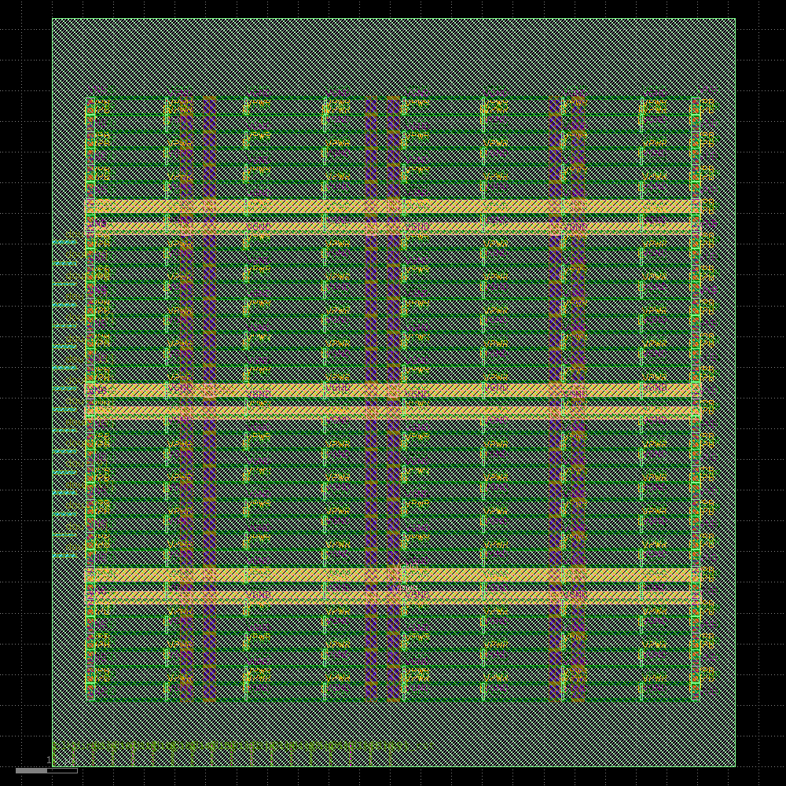
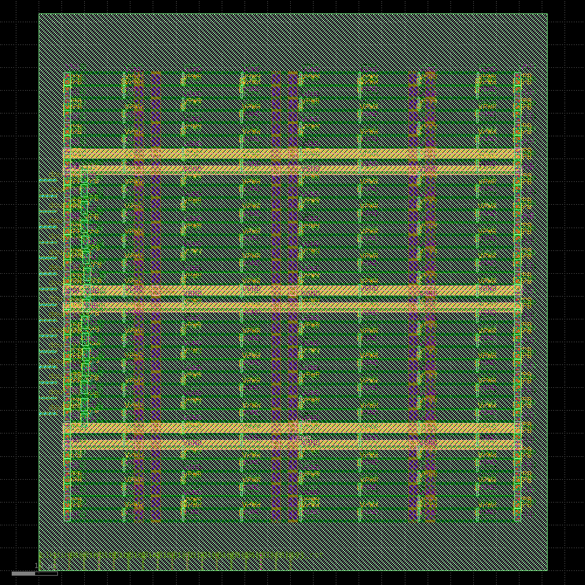
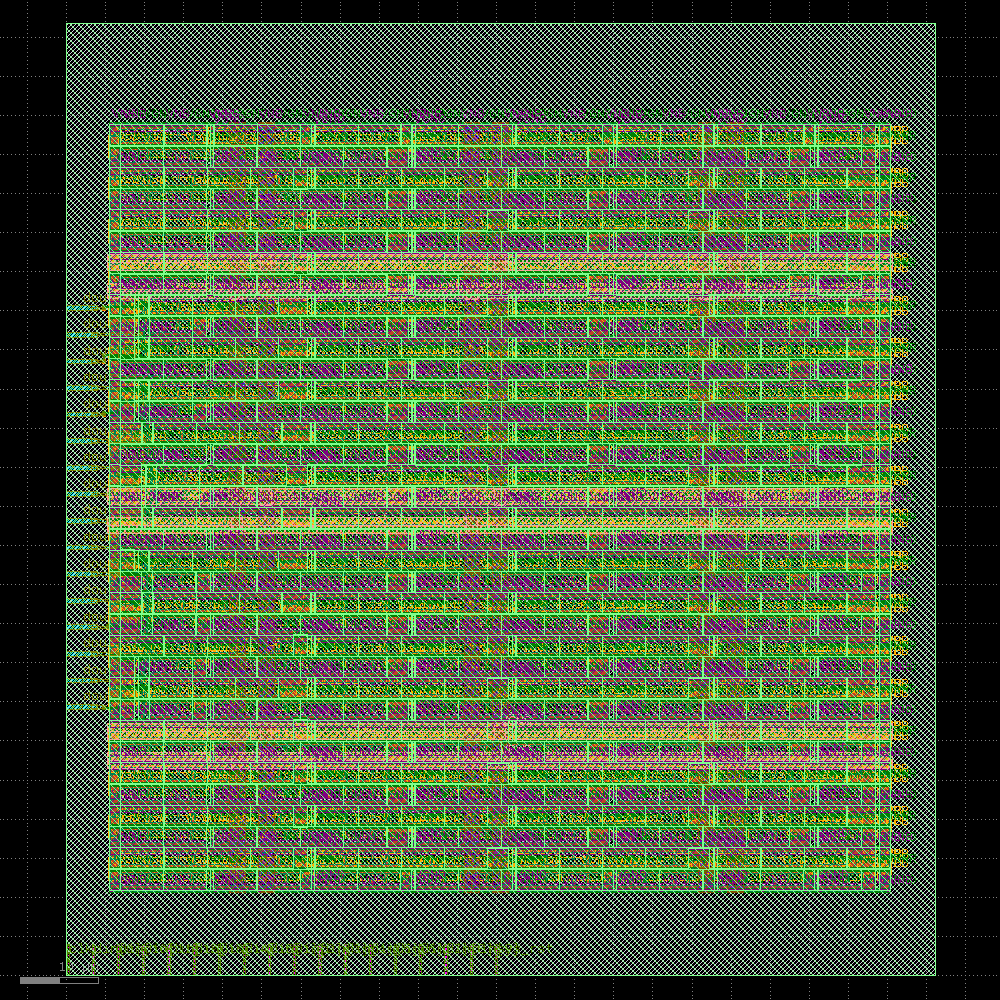
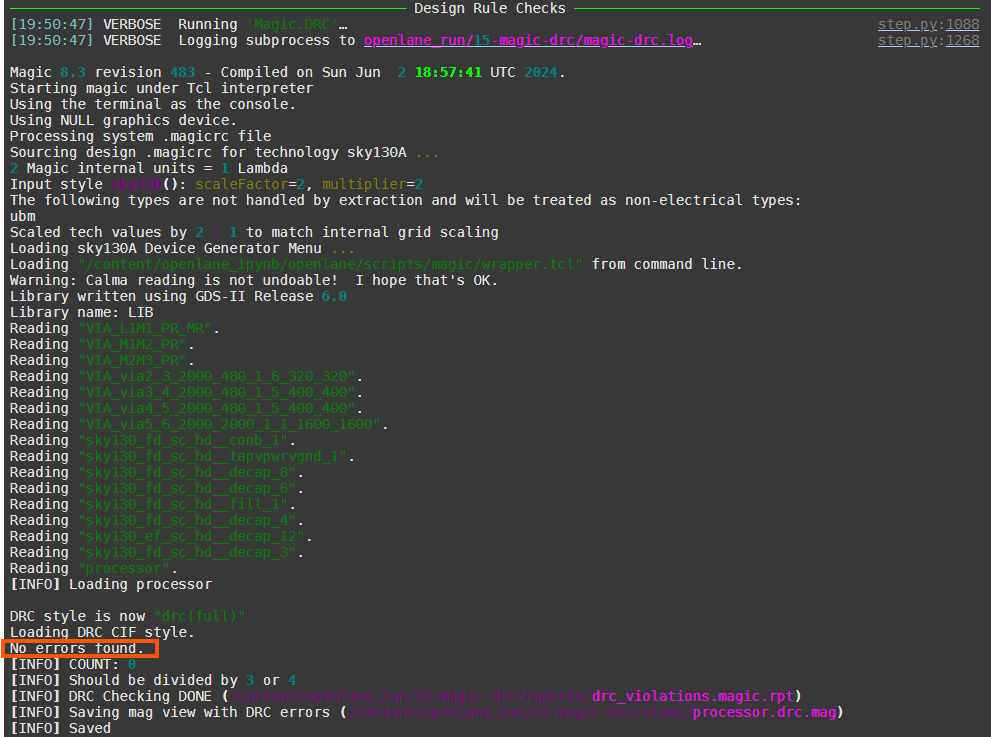
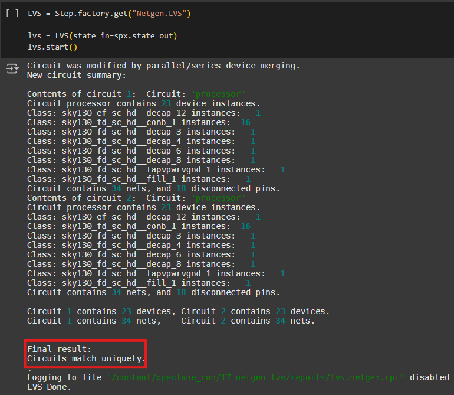
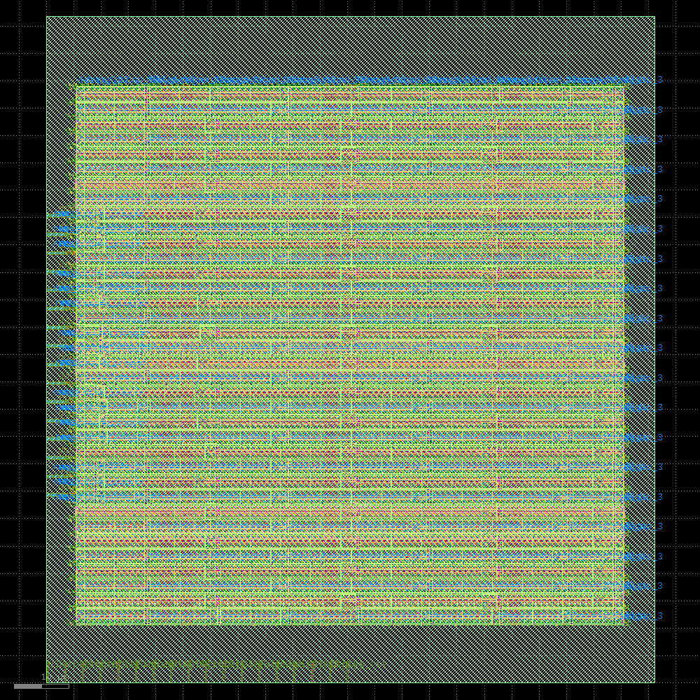

<!-- 
# 32-bit MIPS Processor Implementation
This project implements a 32-bit MIPS processor in Verilog HDL targeting the Xilinx Zynq Zybo FPGA board.

## Architecture

- 32-bit pipelined processor
- Separate 32-bit instruction and 16-bit data memories (Harvard architecture) 
- 32 x 16-bit general purpose registers
- 32-bit program counter

## Instruction Set 

- R-type (Register-Register)
- I-type (Register-Immediate) 
- Arithmetic, logical, load/store, control
- 32-bit fixed length instructions

## Pipeline Stages

The processor has the following 5 pipeline stages:

- Fetch instruction (IF)
- Decode and execute instruction (ID/EX)
- Access memory (MEM) 
- Write back (WB)
- Update PC for next instruction (PC)

## Components

- Control Unit (Finite State Machine)
- Registers 
- ALU
- Instruction Memory
- Data Memory

## Simulation

The processor was simulated using testbenches to verify the functionality.

## Synthesis

The processor RTL code was synthesized targeting the Xilinx Zynq Zybo FPGA board.

## Repository Structure

- `rtl/` - Contains Verilog code for the processor 
- `tb/` - Testbenches for simulation
- `syn/` - Synthesis scripts 
- `docs/` - Documentation (architecture, verification plan etc.)

## Documentation

- [Spec document](https://github.com/mo-faruque/MIPS_Processor/blob/main/docs/MIPS_Project_Description.pdf) - Architecture and implementation details
- [Verification plan](https://github.com/mo-faruque/MIPS_Processor/blob/main/docs/functional-verification/mips_functional_verification.pdf) - Testcases and results
- [FPGA Resources](https://github.com/mo-faruque/MIPS_Processor/blob/main/syn/Detailed%20RTL%20Component%20Info.pdf) - Testcases and results -->

<!--
## Author

John Doe

[github.com/john-doe](https://github.com/john-doe)

## License

This project is licensed under the MIT License - see the [LICENSE](LICENSE) file for details.

-->

 

# 32-bit Lightweight RISC Processor Implementation

This project implements a 32-bit lightweight RISC processor in Verilog HDL. The design is intended as an educational model and is implemented using both FPGA prototyping and ASIC synthesis flows. The processor emphasizes clarity and simplicity with a finite state machine (FSM) controlling a sequential (non-pipelined) instruction cycle.

---

## Architecture

The processor employs a Harvard architecture with separate memories for instructions and data. Key architectural features include:

- **Instruction Register (IR):** A 32-bit register divided into fields (opcode, register operands, immediate data).
- **Datapath:** Consists of 32 general-purpose registers (16 bits each), a special register for multiplication high-order bits, and arithmetic/logic circuitry (acting as a simplified ALU).
- **Control Path:** Implemented as an FSM that sequences the instruction cycle through states such as Idle, Fetch Instruction, Decode & Execute, Delay, Next Instruction, and Sense Halt.
- **Memory:** Separate memories for 32-bit instructions and 16-bit data.

<!-- *Placeholder for Architecture Diagram:*   -->

---

## Instruction Set

The custom instruction set follows RISC-like principles and supports both R-type (Register-Register) and I-type (Register-Immediate) instructions. It includes:

- **Arithmetic:** ADD, SUB, MUL, and MOVSGPR (move from special register).
- **Logical:** AND, OR, XOR, XNOR, NAND, NOR, and NOT.
- **Data Movement:** MOV (register or immediate), plus store/load operations.
- **Control:** Unconditional and conditional jumps (based on flags: carry, sign, zero, overflow) and a HALT instruction that stops execution.

---

## Finite State Machine (FSM)

The processor’s FSM handles sequential instruction execution rather than pipelining. Its states include:

- **Idle:** Reset and initialization.
- **Fetch Instruction:** Loads the instruction from program memory.
- **Decode & Execute:** Decodes the instruction, performs the operation, and updates condition flags.
- **Delay:** Implements a fixed wait period (for timing control).
- **Next Instruction:** Updates the program counter (with jump handling if required).
- **Sense Halt:** Monitors the halt condition and stops further execution when a HALT instruction is encountered.

<!-- *Placeholder for FSM Flow Diagram:*   -->

---

## Simulation and Verification

The processor’s functionality has been verified using testbenches. Simulation results confirm correct execution of arithmetic, logical, memory, and control instructions.

<!-- *Placeholder for Simulation Waveform:*   -->

---

## FPGA Flow

For FPGA prototyping, the RTL code was synthesized for a target such as the Xilinx Zynq Zybo board. The FPGA flow includes:

- **RTL Synthesis:** Mapping the design to FPGA resources using synthesis tools.
- **RTL Schematic Generation:** Visualizing the design structure.
- **Timing Analysis:** Ensuring that the FSM-driven sequential execution meets the timing requirements.

<!-- *Placeholder for FPGA RTL Schematic:*   -->

---

## ASIC Flow

In addition to FPGA prototyping, the design has been implemented using an ASIC flow. The ASIC flow is executed using OpenLane with the SkyWater SKY130 PDK. The steps include:

1. **Toolchain Setup:**
   - **Nix:** For reproducible builds and dependency management.
   - **OpenLane:** The primary toolflow orchestrator.
   - **PDK (Sky130):** Provided by SkyWater and used for ASIC synthesis.

2. **Synthesis:**
   - **Yosys Synthesis:** Converts Verilog to a gate-level netlist.
<!--    
   *Placeholder for Synthesis Results:*  
   
 -->
3. **Floorplanning:**
   - **OpenROAD Floorplan:** Determines chip dimensions and establishes a placement grid.
   
   <!-- *Placeholder for Floorplan Image:*   -->
   

4. **Tap/Endcap Insertion:**
   - **OpenROAD Tap/Endcap Insertion:** Inserts tap cells and end caps for power integrity.
   
   <!-- *Placeholder for Tap/Endcap Insertion:*   -->
   

5. **I/O Placement:**
   - **OpenROAD I/O Placement:** Assigns I/O pins to the chip boundary.

   *Placeholder for I/O Placement Diagram:*  
   

6. **Power Distribution Network (PDN) Generation:**
   - **OpenROAD GeneratePDN:** Creates a grid of power straps for VDD and VSS.
   
   *Placeholder for PDN Diagram:*  
   

7. **Placement and Routing:**
   - **Global Placement & Detailed Placement:** Determines and legalizes the placement of standard cells.
   - **Clock Tree Synthesis (CTS):** Buffers and routes the clock signal.
   - **Global Routing & Detailed Routing:** Plans and executes the wiring between cells.
<!--    
   *Placeholder for Placement/Routing Images:*  
     
    -->

8. **Fill Insertion:**
   - **OpenROAD Fill Insertion:** Inserts decoupling and fill cells to complete the layout.

   *Placeholder for Fill Insertion:*  
   

9. **Parasitic Extraction and Timing Analysis:**
   - **RCX (Resistance/Capacitance Extraction):** Extracts parasitic elements.
   - **Static Timing Analysis (STA):** Verifies timing closure using extracted parasitics.

10. **GDSII Generation and Verification:**
    - **Stream-out (KLayout):** Converts the design to GDSII format for fabrication.
    - **Design Rule Checks (DRC):** Ensures the layout meets foundry requirements.
    

    - **Spice Extraction & LVS:** Extracts a SPICE netlist for Layout vs. Schematic verification.
    

    <!-- *Placeholder for Final Chip Image:*   -->
    

**Tools Used in the ASIC Flow:**

- **Nix** – For reproducible dependency management and environment setup.
- **OpenLane** – The main ASIC flow framework.
- **Yosys Synthesis** – For converting Verilog into a gate-level netlist.
- **OpenROAD** – For floorplanning, placement, routing, CTS, and PDN generation.
- **KLayout** – For stream-out to GDSII.
- **Magic and Netgen** – For DRC, Spice Extraction, and LVS checks.

These tools work together to take the high-level Verilog design and drive it through synthesis, physical design, verification, and final layout generation ready for fabrication.

---

## Repository Structure

- **`rtl/`** – Contains the Verilog code for the processor.
- **`tb/`** – Testbenches for simulation and verification.
- **`syn/`** – Synthesis scripts and constraints for both FPGA and ASIC flows.
- **`docs/`** – Documentation including detailed specifications, synthesis reports, flow diagrams, and placeholder images.
- **`colab/`** – OpenLane ASIC flow scripts (e.g., `risc_design_in_colab.py`) used for running the ASIC implementation in Google Colab.

---

## Documentation

- [Project Specification](docs/Project_Specification.pdf) – Detailed architecture and implementation information.
- [Verification Plan](docs/Verification_Plan.pdf) – Test cases and simulation results.
- [FPGA Synthesis Report](docs/FPGA_Synthesis_Report.pdf) – Details for the FPGA flow.
- [ASIC Synthesis Report](docs/ASIC_Synthesis_Report.pdf) – Comprehensive results from the ASIC flow, including synthesis, placement, and routing.

---

## Conclusion

This project demonstrates a complete design flow for a lightweight RISC processor—from RTL design through simulation, FPGA prototyping, and full ASIC synthesis using OpenLane and associated tools. The integrated ASIC flow, leveraging state-of-the-art tools (Yosys, OpenROAD, KLayout, Magic, and Netgen) with the SkyWater SKY130 PDK, illustrates the processor's readiness for fabrication.