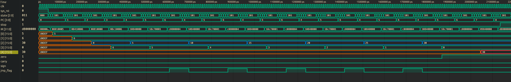
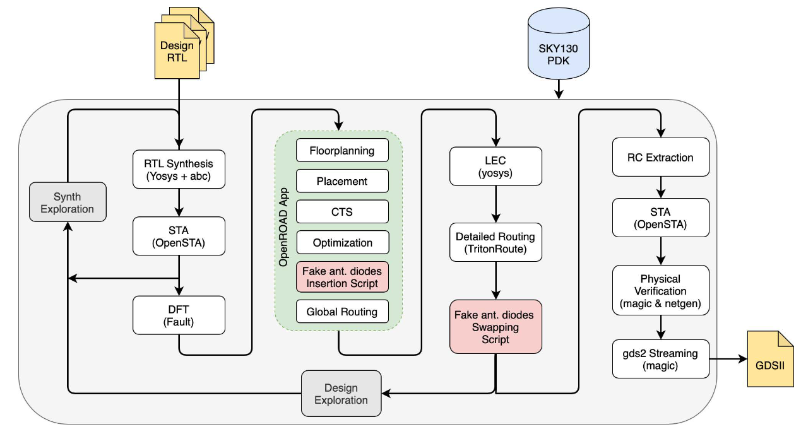
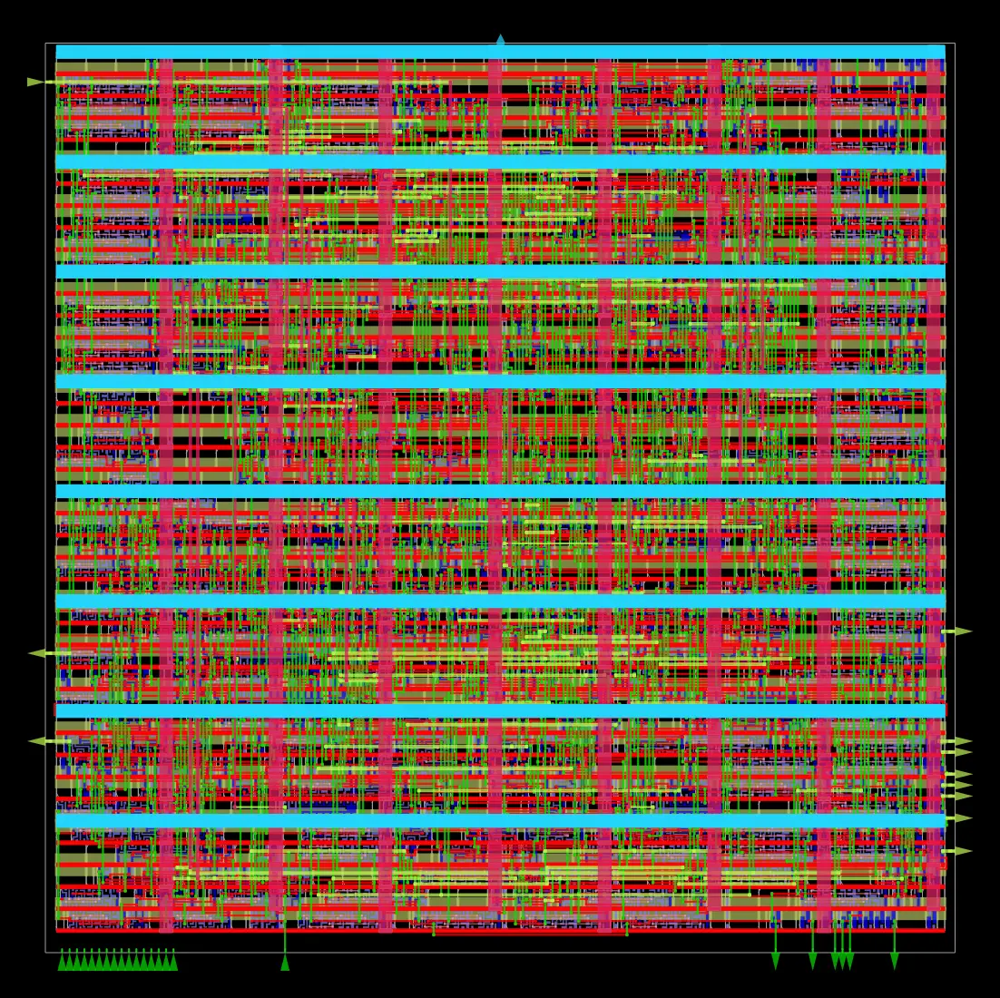
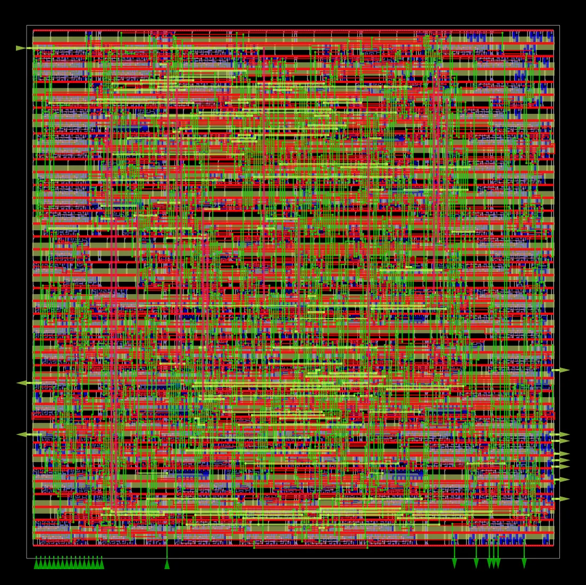
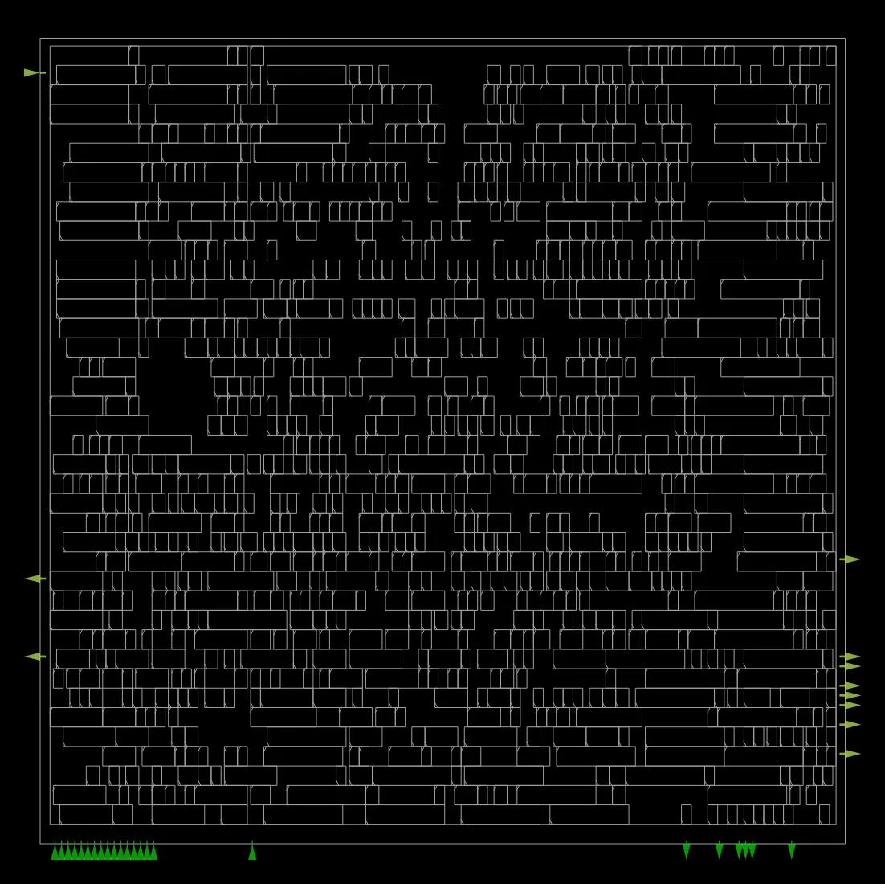
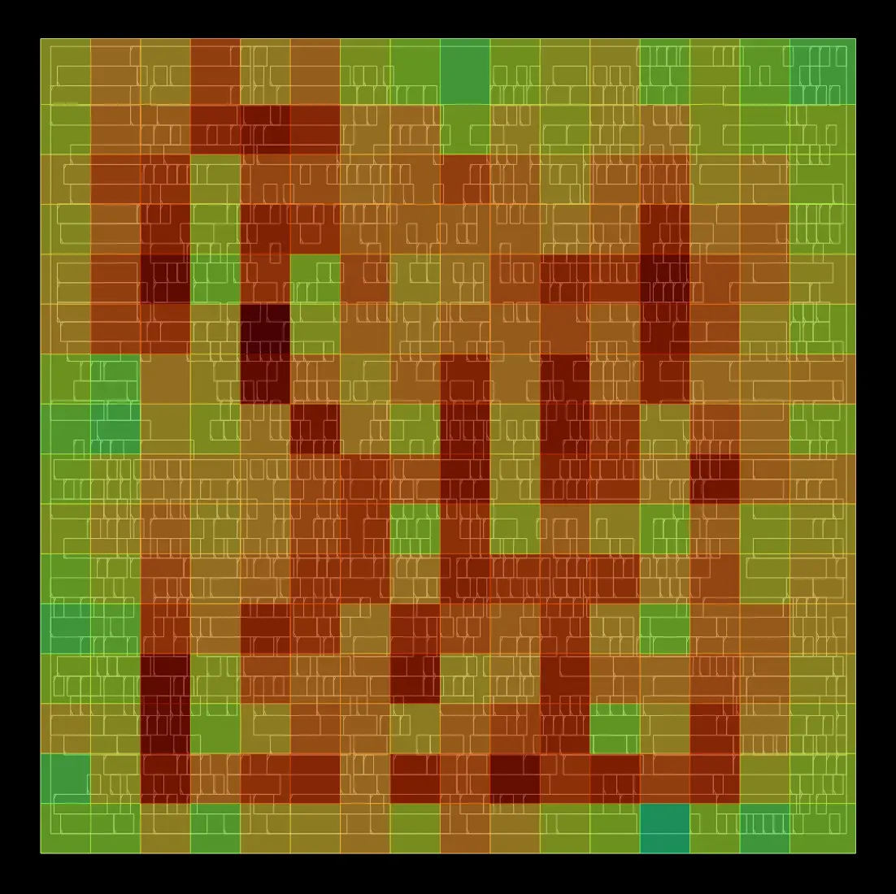
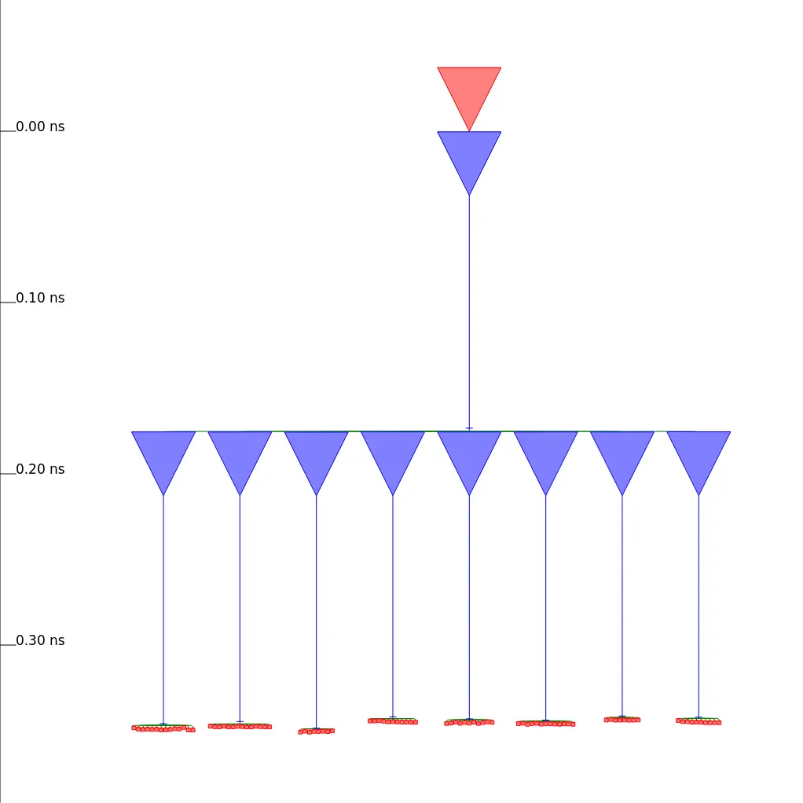
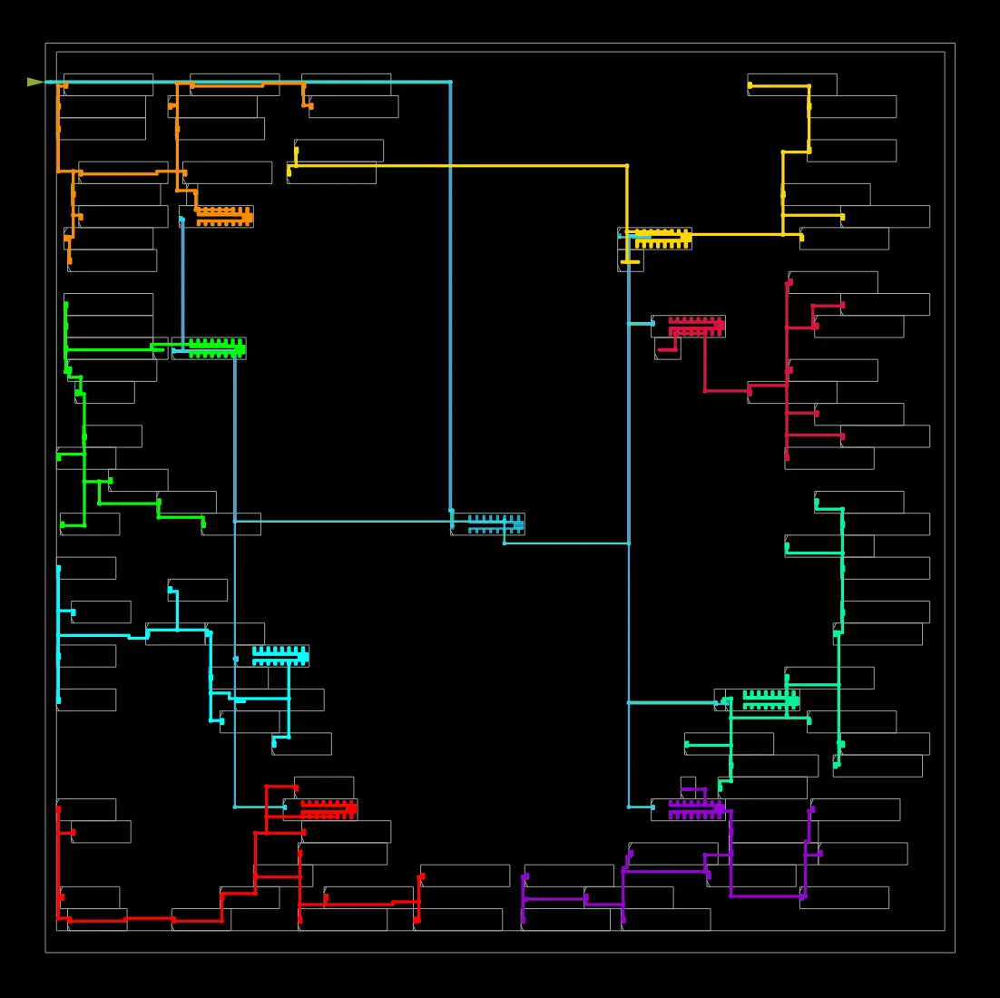
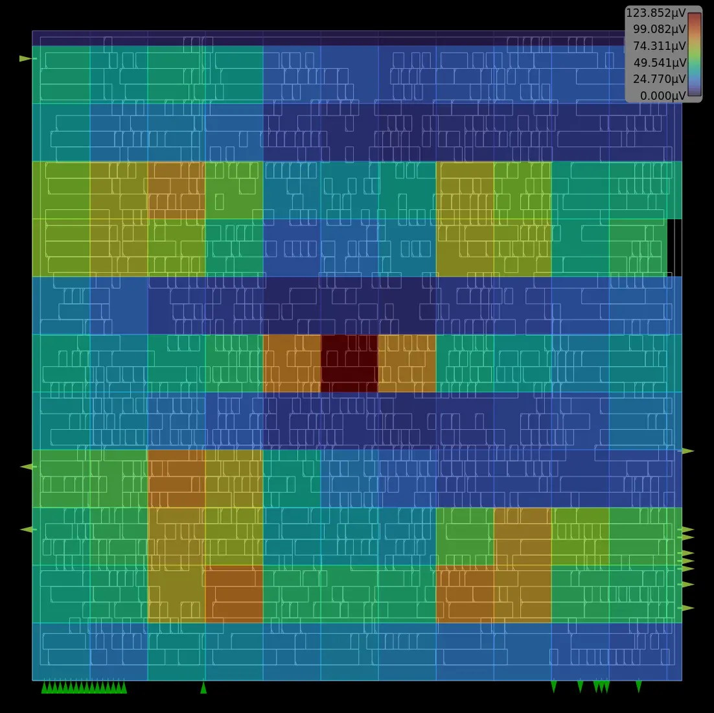

# miniRISC Processor

A 32-bit lightweight RISC processor implemented in Verilog HDL with full ASIC implementation using OpenROAD Flow Scripts (ORFS) targeting SkyWater 130nm technology.

## Processor Architecture

The miniRISC employs a **Harvard architecture** with separate instruction and data memories, controlled by a finite state machine (FSM) for sequential instruction execution.

<table>
<tr>
<td></td>
<td></td>
</tr>
<tr>
<td align="center"><b>Block Diagram</b></td>
<td align="center"><b>FSM State Diagram</b></td>
</tr>
</table>

### Key Features

| Feature | Specification |
|---------|---------------|
| Data Width | 16-bit |
| Instruction Width | 32-bit |
| Register File | 32 x 16-bit GPRs |
| Architecture | Harvard (separate I/D memory) |
| Control | FSM-based (non-pipelined) |

### Instruction Set

| Category | Instructions | Description |
|----------|--------------|-------------|
| Arithmetic | ADD, SUB, MUL, MOVSGPR | Basic math operations |
| Logical | AND, OR, XOR, XNOR, NAND, NOR, NOT | Bitwise operations |
| Data Movement | MOV, LOAD, STORE | Register/memory transfers |
| Control | JMP, JC, JS, JZ, JO, HALT | Conditional/unconditional jumps |

### FSM States

1. **Idle** - Reset and initialization
2. **Fetch** - Load instruction from program memory
3. **Decode & Execute** - Decode opcode, perform operation, update flags
4. **Delay** - Fixed wait period for timing control
5. **Next Instruction** - Update program counter
6. **Sense Halt** - Monitor halt condition

---

## Functional Verification

The processor is verified using a test program that computes **5 × 6 = 30** through iterative addition (without using the MUL instruction).

### Simulation Waveform (Surfer)



**Signal Explanation:**

| Signal | Description | Observed Behavior |
|--------|-------------|-------------------|
| `clk` | System clock | Continuous toggling at 100MHz |
| `sys_rst` | Reset signal | Active high, then released |
| `state[2:0]` | FSM state | Cycles: Idle(0) → Fetch(1) → Execute(2) → Delay(5) → Next(3) → Sense(4) |
| `PC[3:0]` | Program counter | 0→1→2→3→4→5→6→**4→5→6** (loop)→7→8 |
| `IR[31:0]` | Instruction register | Shows fetched instruction in hex |
| `[0][15:0]` | GPR[0] - Multiplier | Loaded with **5**, unchanged |
| `[1][15:0]` | GPR[1] - Multiplicand | Loaded with **6**, unchanged |
| `[2][15:0]` | GPR[2] - Accumulator | **0→5→10→15→20→25→30** (adds 5 each iteration) |
| `[3][15:0]` | GPR[3] - Loop counter | **6→5→4→3→2→1→0** (decrements each iteration) |
| `[4][15:0]` | GPR[4] - Result | Copies final value **30** |
| `zero` | Zero flag | Goes **HIGH** when GPR[3] reaches 0 (loop exit) |
| `jmp_flag` | Jump taken flag | Pulses HIGH during JNZ back-jumps |

**Key Observations:**
- The loop executes **6 times** (PC jumps from 6 back to 4)
- GPR[2] accumulates: 0 + 5 + 5 + 5 + 5 + 5 + 5 = **30**
- When GPR[3] = 0, the `zero` flag triggers loop exit
- Final result (30) is copied to GPR[4] before HALT

### Run Simulation

```bash
# Compile testbench
iverilog -o tb/tb_test designs/src/miniRISC/miniRISC_core.v tb/tb_functional_verify.v

# Run simulation (generates .vcd)
vvp tb/tb_test

# View waveform
surfer tb/tb_functional_verify.vcd
# or
gtkwave tb/tb_functional_verify.vcd
```

---

## 3D GDS Visualization

https://github.com/user-attachments/assets/3D_final_gds.mp4

<video src="docs/images/3D_final_gds.mp4" width="600" controls>
  Your browser does not support the video tag.
</video>

> **Note:** If video doesn't play, download [3D_final_gds.mp4](docs/images/3D_final_gds.mp4) and view locally, or use [KLayout](https://klayout.de) or [GDS3D](https://github.com/trilomix/GDS3D) for interactive 3D visualization.

The 3D view shows the physical layer stackup of the fabricated chip:
- **Bottom layers:** Standard cells (logic gates, flip-flops)
- **Metal layers (met1-met5):** Interconnect routing in alternating horizontal/vertical directions
- **Top layers:** Power distribution network (VDD/VSS rails)

---

## ASIC Implementation

The miniRISC processor is implemented using **OpenROAD Flow Scripts (ORFS)**, an open-source RTL-to-GDS flow.

### OpenROAD Flow

<table>
<tr>
<td align="center"><b>ORFS High-Level Flow</b></td>
<td align="center"><b>OpenROAD Detailed Flow</b></td>
</tr>
<tr>
<td></td>
<td></td>
</tr>
<tr>
<td align="center"><a href="https://github.com/The-OpenROAD-Project/OpenROAD-flow-scripts/blob/master/docs/images/ORFS_Flow.svg">Source: OpenROAD-flow-scripts</a></td>
<td align="center"><a href="https://dl.acm.org/doi/10.1145/3400302.3415735">Source: ICCAD 2020</a></td>
</tr>
</table>

**Flow Stages:**
1. **Synthesis (Yosys)** → RTL to gate-level netlist
2. **Floorplanning** → Die area, I/O placement, power grid
3. **Placement** → Global and detailed cell placement
4. **Clock Tree Synthesis (CTS)** → Balanced clock distribution
5. **Routing** → Global and detailed interconnect routing
6. **Finishing** → Fill insertion, GDSII generation

---

### Project Structure

```
miniRISC_Processor/
├── designs/
│   ├── sky130hd/miniRISC/      # Flow config (config.mk, constraint.sdc, autotuner.json)
│   └── src/miniRISC/           # RTL source (miniRISC_core.v, inst_data.mem)
├── docs/
│   ├── images/                 # Diagrams, layout views, waveforms, 3D video
│   └── miniRISC_ASIC_Report.*  # LaTeX report (.tex, .pdf)
├── tb/                         # Testbenches (functional, ALU, logic, flags)
├── logs/sky130hd/miniRISC/     # Flow logs
├── reports/sky130hd/miniRISC/  # Timing, power, area reports
├── results/sky130hd/miniRISC/  # Output files (GDS, DEF, netlist)
├── run_flow                    # RTL-to-GDS script
├── run_autotuner               # AutoTuner script
└── Dockerfile.autotuner*       # Docker images
```

## Prerequisites

```bash
docker pull openroad/orfs:latest

# Build AutoTuner image (one-time, ~5 min)
docker build -t orfs-autotuner - < Dockerfile.autotuner-lite
```

## Run Full RTL-to-GDS Flow

```bash
./run_flow           # Run complete flow
./run_flow clean     # Clean all build artifacts
```

## Run Individual Stages

```bash
./run_flow synth      # Synthesis
./run_flow floorplan  # Floorplanning
./run_flow place      # Placement
./run_flow cts        # Clock tree synthesis
./run_flow route      # Routing
./run_flow finish     # Final GDS generation
./run_flow shell      # Open interactive shell in container
./run_flow cmd "..."  # Run arbitrary command
```

## Output Locations

| Output | Path |
|--------|------|
| GDS | `results/sky130hd/miniRISC/base/6_final.gds` |
| DEF | `results/sky130hd/miniRISC/base/6_final.def` |
| Netlist | `results/sky130hd/miniRISC/base/6_final.v` |
| Timing Report | `logs/sky130hd/miniRISC/base/6_report.json` |

---

## AutoTuner (Automatic PPA Optimization)

AutoTuner uses Bayesian optimization (TPE) to find optimal flow parameters for Performance, Power, and Area.

```bash
# Run AutoTuner with default settings (10 samples, 2 parallel jobs)
./run_autotuner

# Specify samples, jobs, and algorithm
./run_autotuner -s 20 -j 4 -a hyperopt

# Run with PPA-improvement mode (balanced optimization)
./run_autotuner -s 20 -j 2 -a hyperopt \
    --eval ppa-improv \
    --reference logs/sky130hd/miniRISC/base/6_report.json \
    -e miniRISC_ppa
```

<details>
<summary><b>Command Reference</b></summary>

| Option | Description |
|--------|-------------|
| `-s, --samples N` | Number of tuning samples (default: 10) |
| `-j, --jobs N` | Parallel jobs (default: 2) |
| `-a, --algorithm` | Search algorithm: ax, hyperopt, optuna, pbt, random |
| `-d, --design` | Design name (default: miniRISC) |
| `-p, --platform` | Target platform (default: sky130hd) |
| `-c, --config` | Path to autotuner.json |
| `-e, --experiment` | Experiment name for results |
| `--eval MODE` | Evaluation mode: `default` (speed) or `ppa-improv` (balanced) |
| `--reference PATH` | Reference metrics JSON for ppa-improv mode |
| `--seed N` | Random seed (0 = no seed) |
| `--resume` | Resume previous experiment run |

</details>

<details>
<summary><b>Results & Visualization</b></summary>

Results are stored in `logs/sky130hd/miniRISC/<experiment>-tune/`.

```bash
# Best parameters saved to JSON
cat logs/sky130hd/miniRISC/miniRISC_tune-tune/autotuner-best-*.json
```

**Optimization Plots:** See `docs/images/` for layout visualizations

**TensorBoard:**
```bash
tensorboard --logdir=logs/sky130hd/miniRISC/miniRISC_tune-tune
# Access at http://localhost:6006/
```

</details>

---

## Design Configuration

Edit `designs/sky130hd/miniRISC/config.mk`:

```makefile
export CORE_UTILIZATION = 60    # Higher = smaller die
export PLACE_DENSITY    = 0.65  # Placement density
export ABC_AREA         = 1     # Area-optimized synthesis
```

Edit `designs/sky130hd/miniRISC/constraint.sdc`:

```tcl
set clk_period 6.5  # Clock period in ns
```

<details>
<summary><b>Docker Volume Mount Details</b></summary>

**Problem**: Mounting the entire ORFS directory overwrites Docker image's pre-compiled tools.

**Solution**: The `run_flow` script mounts only specific subdirectories:

```bash
-v ./designs:/OpenROAD-flow-scripts/flow/designs
-v ./logs:/OpenROAD-flow-scripts/flow/logs
-v ./reports:/OpenROAD-flow-scripts/flow/reports
-v ./results:/OpenROAD-flow-scripts/flow/results
```

This preserves the Docker image's `tools/install/` directory containing yosys and openroad binaries.

</details>

---

# How to Interpret Layout Images

<details>
<summary><b>Click to expand image interpretation guide</b></summary>

### Final Layout View
Shows all design elements: colored rectangles are standard cells, lines are metal routing, peripheral rectangles are I/O pads.

### Routing View
**Color coding by metal layer:**
- **li1 (Local interconnect):** Lowest layer, within-cell connections
- **met1 (Blue):** First metal, primarily horizontal
- **met2 (Pink/Red):** Second metal, primarily vertical
- **met3-met5:** Higher metals for power and long routes

### Placement View
- **Dense regions:** High logic density
- **Uniform distribution:** Good placement quality
- **Clustering:** Related logic grouped together

### Routing Congestion Heatmap
- **Blue/Green:** Low congestion (good)
- **Yellow:** Moderate congestion
- **Orange/Red:** High congestion (routing issues)

### IR Drop Heatmap
Shows voltage drop across power network:
- **Blue/Green:** Minimal drop (good power delivery)
- **Red:** High drop (may cause timing issues)
- **Acceptable:** <5% of VDD (1.8V → <90mV)

### Clock Tree View
- **Tree structure:** Balanced branching from root to leaves
- **Buffer stages:** Number of levels
- **Skew:** Difference in arrival times (want minimal)

</details>

---

# Implementation Results

## miniRISC @ sky130hd (Default Flow)

> **Design:** miniRISC | **Platform:** sky130hd | **Clock Target:** 6.5 ns | **Runtime:** ~2 min

### Summary

| Metric | Value | Status |
|--------|-------|--------|
| **Fmax** | 256.21 MHz | - |
| **Clock Period** | 3.90 ns (achieved) | MET |
| **Die Area** | 12,678.8 µm² | - |
| **Core Utilization** | 63.96% | - |
| **Total Power** | 1.31 mW | - |
| **DRC Violations** | 0 | CLEAN |
| **Timing Violations** | 0 | CLEAN |

### Layout Views

<table>
<tr>
<td align="center"><b>Final Layout</b></td>
<td align="center"><b>Routing</b></td>
</tr>
<tr>
<td></td>
<td></td>
</tr>
<tr>
<td align="center"><b>Placement</b></td>
<td align="center"><b>Routing Congestion</b></td>
</tr>
<tr>
<td></td>
<td></td>
</tr>
</table>

---

### Timing Analysis

| Metric | Value | Status |
|--------|-------|--------|
| Clock Target | 6.50 ns | - |
| Achieved Period | 3.90 ns | MET |
| Fmax | 256.21 MHz | - |
| Setup Slack (WNS) | 2.60 ns | MET |
| Hold Slack | 0.42 ns | MET |
| TNS (Total Negative Slack) | 0.00 ns | CLEAN |
| WNS (Worst Negative Slack) | 0.00 ns | CLEAN |
| Setup Violations | 0 | CLEAN |
| Hold Violations | 0 | CLEAN |

**Critical Path:** `IR[17] → GPR[2][11]` (3.97 ns data arrival)

---

### Clock Tree Synthesis

<table>
<tr>
<td align="center"><b>Clock Tree</b></td>
<td align="center"><b>Clock Tree Layout</b></td>
</tr>
<tr>
<td></td>
<td></td>
</tr>
</table>

| Metric | Value |
|--------|-------|
| Clock Buffers | 11 |
| Clock Inverters | 5 |
| Clock Skew (Setup) | 7.4 ps |
| Clock Skew (Hold) | 7.4 ps |
| Source Latency | 0.34 ns |
| Target Latency | 0.35 ns |

---

### Design Rule Checks (DRC)

| Check | Limit | Slack | Violations | Status |
|-------|-------|-------|------------|--------|
| Max Slew | 1.486 ns | 0.583 ns | 0 | CLEAN |
| Max Capacitance | 36.6 fF | 14.8 fF | 0 | CLEAN |
| Max Fanout | - | - | 0 | CLEAN |
| Routing DRC | - | - | 0 | CLEAN |
| Antenna | - | - | 0 | CLEAN |

---

### Power Analysis

<table>
<tr>
<td align="center"><b>IR Drop Heatmap</b></td>
</tr>
<tr>
<td></td>
</tr>
</table>

**Power by Category:**

| Category | Internal | Switching | Leakage | Total | % |
|----------|----------|-----------|---------|-------|---|
| Sequential | 611 µW | 12.3 µW | 0.75 nW | 623 µW | 47.6% |
| Combinational | 56.4 µW | 122 µW | 2.57 nW | 178 µW | 13.6% |
| Clock | 298 µW | 209 µW | 0.14 nW | 507 µW | 38.7% |
| **Total** | **965 µW** | **343 µW** | **3.46 nW** | **1.31 mW** | 100% |

**Distribution:** 73.8% Internal, 26.2% Switching, ~0% Leakage

**IR Drop:**

| Net | Worst Voltage | Average Drop | Worst Drop | % Drop |
|-----|---------------|--------------|------------|--------|
| VDD | 1.7998 V | 25.6 µV | 159.6 µV | 0.01% |
| VSS | 123.9 µV | 19.6 µV | 123.9 µV | 0.01% |

---

### Congestion Analysis

**Global Routing Congestion (per metal layer):**

| Layer | Resource | Demand | Usage (%) | Overflow |
|-------|----------|--------|-----------|----------|
| li1 | 0 | 0 | 0.00% | 0 |
| met1 | 2,291 | 1,145 | 49.98% | 0 |
| met2 | 2,415 | 1,236 | 51.18% | 0 |
| met3 | 1,803 | 169 | 9.37% | 0 |
| met4 | 885 | 103 | 11.64% | 0 |
| met5 | 240 | 0 | 0.00% | 0 |
| **Total** | **7,634** | **2,653** | **34.75%** | **0** |

**Routing Statistics:**

| Metric | Value |
|--------|-------|
| Total Wirelength | 30,546 µm |
| Routed Nets | 1,055 |
| Total Overflow | 0 (no congestion) |
| Weighted Congestion | 1.025 |

**Placement Congestion:**

| Metric | Value |
|--------|-------|
| Overflowed Tiles | 3 (1.17%) |
| Top 0.5% Congestion | 1.017 |
| Top 1.0% Congestion | 1.012 |
| Top 2.0% Congestion | 1.003 |
| Top 5.0% Congestion | 0.987 |

---

### Area & Cell Statistics

| Metric | Value |
|--------|-------|
| Die Area | 12,678.8 µm² |
| Core Area | 11,961.5 µm² |
| Core Utilization | 63.96% |
| Rows | 40 |
| Sites | 9,560 |

<details>
<summary><b>Cell Breakdown</b></summary>

| Cell Type | Count | Area (µm²) |
|-----------|-------|------------|
| Standard Cells | 1,186 | 7,651.1 |
| Sequential Cells | 89 | 2,422.3 |
| Combinational Cells | 815 | 4,271.6 |
| Inverters | 110 | 412.9 |
| Clock Buffers | 11 | 232.7 |
| Clock Inverters | 5 | 57.6 |
| Timing Repair Buffers | 9 | 70.1 |
| Fill Cells | 1,079 | 4,310.4 |
| Tap Cells | 147 | 183.9 |

</details>

<details>
<summary><b>Synthesis Gate Statistics</b></summary>

| Gate Type | Count | Area (µm²) |
|-----------|-------|------------|
| NAND2 | 314 | 1,178.6 |
| NOR2 | 109 | 409.1 |
| NAND3 | 88 | 440.4 |
| INV | 99 | 371.6 |
| A21OI | 57 | 285.3 |
| DFF (dfxtp) | 25 | 500.5 |
| DFF w/ Enable (edfxtp) | 64 | 1,920.0 |
| Half Adder | 48 | 600.6 |
| XOR2 | 19 | 166.4 |
| Buffers | 41 | 315.3 |
| **Total** | **1,032** | **7,339.5** |

Sequential elements: 33% of synthesis area

</details>

### I/O Ports

| Port | Width | Direction |
|------|-------|-----------|
| clk | 1 | input |
| sys_rst | 1 | input |
| din | 16 | input |
| dout | 16 | output |
| **Total** | **36** | - |

---

## miniRISC @ sky130hd (AutoTuner Optimized)

> **Design:** miniRISC | **Platform:** sky130hd | **Samples:** 20 | **Algorithm:** hyperopt

### Best Parameters Found

| Parameter | Default | AutoTuner | Description |
|-----------|---------|-----------|-------------|
| _SDC_CLK_PERIOD | 6.50 ns | 5.26 ns | Clock target |
| CORE_UTILIZATION | 60% | 52% | Core utilization |
| CORE_ASPECT_RATIO | 1.0 | 0.999 | Aspect ratio |
| CORE_MARGIN | 2 | 2 | Core margin |
| PLACE_DENSITY_LB_ADDON | 0.0 | 0.10 | Placement density addon |
| CTS_CLUSTER_SIZE | 30 | 22 | CTS cluster size |
| CTS_CLUSTER_DIAMETER | 100 | 69 | CTS cluster diameter |

### Results

| Metric | Value |
|--------|-------|
| Fmax | 263 MHz |
| Effective Clock Period | 3.80 ns |
| Die Area | 15,081 µm² |
| Optimization Metric | 379.80 |

---

## Comparison: Default vs AutoTuner

| Metric | Default | AutoTuner | Change |
|--------|---------|-----------|--------|
| Fmax | 256.21 MHz | 263 MHz | **+2.7%** |
| Clock Period | 3.90 ns | 3.80 ns | **-2.6%** |
| Die Area | 12,679 µm² | 15,081 µm² | +19% |
| Core Utilization | 63.96% | 52% | -12% |

**Conclusion:** AutoTuner achieved 2.7% higher frequency at the cost of 19% larger die area (speed-optimized mode). For area-constrained designs, use `--eval ppa-improv` mode.

---

## Documentation

For a comprehensive report with detailed explanations, see:

- **[LaTeX Report](docs/miniRISC_ASIC_Report.tex)** - Full ASIC implementation report (compile with `pdflatex`)

```bash
cd docs && pdflatex miniRISC_ASIC_Report.tex
```
